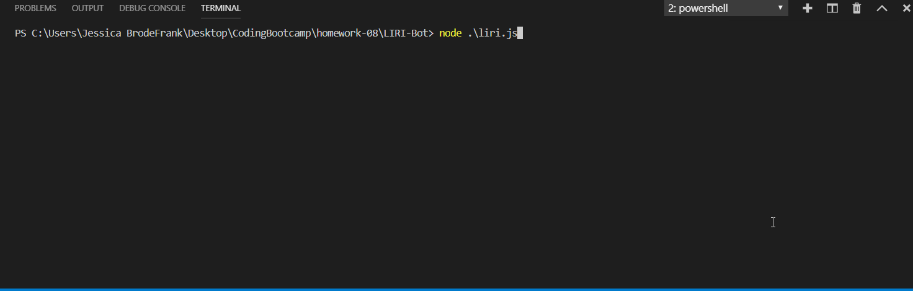

# LIRI-Bot

LIRI-Bot is a termal app that allows the user to easily search for information about movies, songs, and upcoming concerts artists have. Using inquirer makes the user input easy to understand and use.

LIRI-Bot uses the following APIs to return the requested information. In order to use LIRI-Bot you will need to have API Keys for the following APIs to access their information. 
OMDB API for movie information.
BandsInTown API for upcoming concert information.
Spotify API for song information.

To add your API Keys create a .env file with the following values set to the indicated keys and ids.
SPOTIFY_ID=[spotify id]
SPOTIFY_SECRET=[spotify secrect]
OMDB_API_KEY=[omdb api key]
BANDS_API_KEY=[bands in town id]

Make sure to have all npm dependencies installed before running the app.
Dependencies include: axios, dotenv, inquirer, moment, and node-spotify-api.